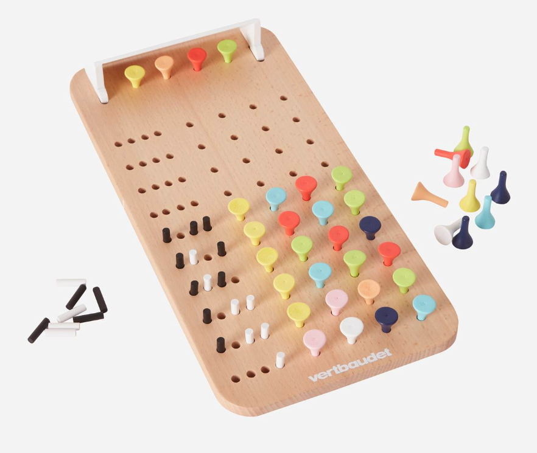
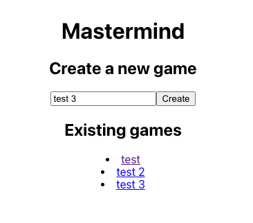
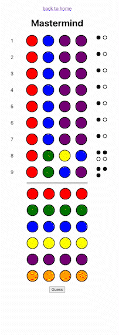

# Evaluation 3 - Mastermind

## Les règles du jeu 🎮

Le Mastermind est un jeu de société pour deux joueurs:
- L'un joue le rôle de "codeur" (dans notre cas l'ordinateur), l'autre joue le rôle de "devineur" (dans notre cas l'utilisateur). 
- Le codeur choisit une combinaison secrète de 4 couleurs à l'aide de chevilles (pegs) colorées parmi un ensemble prédéfini (red, blue, green, yellow, orange, purple). 
- Le devineur doit deviner cette combinaison faisant des propositions de combinaison de couleurs à l'aide de chevilles (Pegs). 
- Pour chaque proposition, le codeur indique à l'aide de goujons (pins) combien de couleurs sont correctes et à la bonne place (black pins), et combien de couleurs sont correctes mais à la mauvaise place (white pins). 
- Le devineur doit ensuite utiliser ces informations pour faire de meilleures propositions jusqu'à ce qu'il devine la combinaison secrète ou jusqu'à ce qu'il atteigne un nombre maximum de 10 propositions.

## Ce que vous recevez 🧳

Un **backend** NodeJS avec une API nodejs et une class Game à compléter.

> Le backend comprend des tests unitaires qui peuvent être lancés avec la commande `npm test` dans le dossier backend ou depuis un IDE.
> L'API du backend retourne une partie de test à l'adresse: http://localhost:8080/api/games/test.

Un **frontend** React avec une interface utilisateur pour jouer au mastermind.

> Le frontend affiche la partie de test à l'adresse: http://localhost:3000/test.

> ⚠️ Tant que les tâches du backend ne sont pas terminées, le frontend n'affichera pas un feedback correct.

## Votre mission 🕵🏻‍

Vous avez la liste des tâches à effectuer:
- (8 points) Complétez le fichier `mastermind.js` du backend pour que la fonction `play` retourne un objet de type feedback avec l'entrée de l'utilisateur (guess), le nombre de couleurs correctes et à la bonne place (black pins), et le nombre de couleurs correctes mais à la mauvaise place (white pins).
- (2 points) Complétez le fichier `mastermind.js` du backend pour cacher la solution du mastermind (game.code) à l'utilisateur sans utiliser le mot clé `delete`.
- (2 points) Complétez le fichier `routes.js` du backend avec une route pour lister les parties en cours.
- (2 points) Complétez le fichier `routes.js` du backend avec une route pour supprimer une partie en cours.
- (4 points) Complétez le fichier `Home.jsx` du frontend pour afficher la liste des parties en cours avec un lien vers la page de la partie.
- (8 points) Créez un nouveau composant React pour remplacer la séléction des couleurs dans le fichier `GuessForm.jsx` du frontend (le résultat désiré est présenté dans la vidéo).

### Précisions concernant la page Home 🏡

La capture d'écran ci-dessous montre la liste des parties en cours.

### Précisions concernant le composant de séléction des couleurs 🎨

Le composant actuellement disponible est un simple select HTML contenant des strings. 
Il serait préférable d'avoir un composant qui affiche les couleurs sous forme de boutons.
Chaque joueur pourra ainsi cliquer sur le bouton pour sélectionner la couleur désirée.

Le gif ci-dessous montre le résultat désiré.
Le joueur devrait voir quatre rangées de boutons, un pour chaque couleur. 
La couleur sélectionnée devrait être mise en évidence à l'aide de la bordure.

## Comment démarrer 🚀

Executez npm install dans le dossier backend et frontend pour installer les dépendances.

Consultez les fichiers `package.json` pour voir les scripts disponibles.

## A vous de jouer 🏁

L'accès à Internet est autorisé et vous pouvez utiliser les ressources que vous voulez (GPT, Copilot, MDN, etc.).

Il est strictement interdit de copier le code d'un autre candidat ou de communiquer avec un autre candidat.

Bonne chance!
